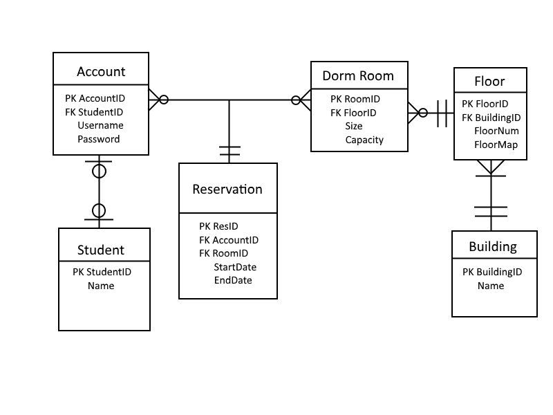

Project proposal report  
Group 4  
Eric, Heitor, Roger, Kate
===
## Project Description
### Requirements/Deliverables:
* Students will be able to sign into the system to reserve dorm rooms for themselves for a given time
    * They will need to see what rooms are available
    * They can view and edit their reservations
* Admins should be able to make changes to items in the database
    * Adding/removing rooms
    * Adding/removing students
    * etc.
    * View more detailed information on which students have been in which rooms
* Search rooms by date
    * Students will see available/not available
    * Admins can view specific students
* Search for students
    * Id
    * Room/date

## Process Model
* Student
    * View available rooms for date
    * View available dates for room
    * Reserve room for date
    * View their room reservations
    * Edit current/future room reservations
    * Create account
        1. Assuming admin has already added student to Students table
        2. Student selects username and password, enters StudentID
        3. Account is added to Accounts table
* Admin
    * See rooms student has reserved
    * See students in room
    * Add/Edit/Remove rooms/buildings/students/user accounts
    * View usage statistics

## Database Model
* Accounts (**AccountID**, Username, Password, _StudentID_)
* Students (**StudentID**, Name)
* DormRooms (**RoomID**, Size, _FloorID_, Capacity)
* Floors (**FloorID**, _BuildingID_, FloorNumber, FloorMap) *Possibly
* Building (**BuildingID**, Name) *Possibly
* Reservations (**ResID**, _AccountID_, _RoomID_, StartDate, EndDate)

## ER Diagram

## User Interface
|**Login Window**|(2 Screens)|
|---|---|
|Login|Allows students or admins to log in|
|Register|Allows students to create an account with their student id|

|**Student Window**|(3 Screens)|
|---|---|
|Reserve room|Allows student to select a room and dates to view availability and reserve that room|
|View reservations|Allows student to view summary of current, future, and past reservations|
|View/edit specific reservation|Allows the student to view more details about a reservation and make changes if applicable|

|**Admin Window**|(~6 Screens)|
|---|---|
|View rooms|View room list, and select a room to view students in that room|
|View students|View student list, and select a student to view rooms that student has been in|
|**Add/Edit/Delete**|Allows admin to make changes to things|
||* Students, Rooms, Building, User Accounts|

## Project Plan
#### General Tasks
* Make Forms
* Possibly make some form of backend using REST (pending class requirements and ease of addition)
* Set up database
* Connect to database
* Client/server side logic

#### Team Roles
* Team members will work together on multiple tasks, in order to implement all the program requirements.

#### Example project schedule
* **Week 1:** Design and create initial forms, get database set up
* **Week 2:** Begin implementation. Test connecting to database and displaying information on forms
* **Week 3:** Continue implementation, get to workable point
* **Week 4:** Finish bugfixes, stress tests